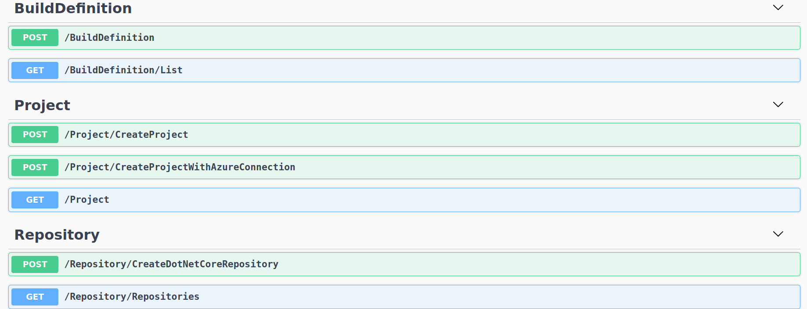

# How to use it
How must specify some information like the authentication token or the Azure information needed for the service connection. Just search for the "//TODO" tag.

There is a Swagger interface that let you request the API.

The swagger interface let you create a project, a repository and a build definition.
